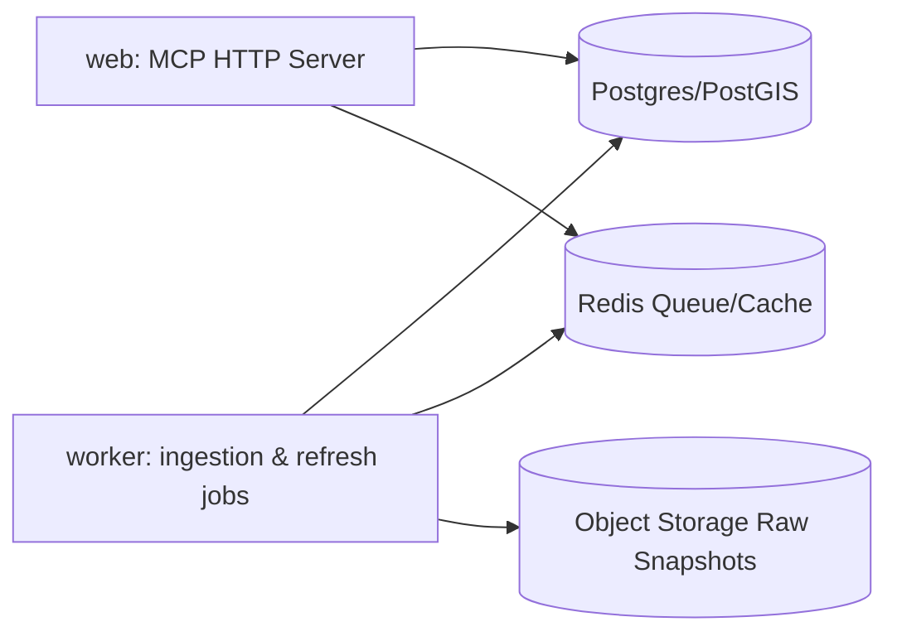

# İstanbul MCP — Kapsamlı Ürün, Mimari ve Yol Haritası

> **Amaç:** İBB ve İstanbul açık verilerini AI asistanların gerçek, güncel ve kaynaklı biçimde kullanabileceği bir MCP server haline getirmek.  
> **Hedef:** Kullanıcı Claude, ChatGPT, Cursor veya başka bir MCP client içine tek bir URL eklesin; asistan İstanbul verisini tahminle değil, kaynaklı veriyle kullansın.

---

## İçindekiler

1. [Ana ürün vizyonu](#1-ana-ürün-vizyonu)
2. [Araştırma özeti](#2-araştırma-özeti)
3. [Ürün kapsamı](#3-ürün-kapsamı)
4. [Önerilen mimari](#4-önerilen-mimari)
5. [Teknik stack](#5-teknik-stack)
6. [Veri kaynakları ve katmanlar](#6-veri-kaynakları-ve-katmanlar)
7. [MCP yüzeyi: tools, resources, prompts](#7-mcp-yüzeyi-tools-resources-prompts)
8. [Veri modeli](#8-veri-modeli)
9. [Cache ve freshness stratejisi](#9-cache-ve-freshness-stratejisi)
10. [Güvenlik tasarımı](#10-güvenlik-tasarımı)
11. [Performans stratejisi](#11-performans-stratejisi)
12. [Railway deploy mimarisi](#12-railway-deploy-mimarisi)
13. [Repo yapısı](#13-repo-yapısı)
14. [Yol haritası](#14-yol-haritası)
15. [Fark yaratacak özellikler](#15-fark-yaratacak-özellikler)
16. [API/tool response standardı](#16-apitool-response-standardı)
17. [Test planı](#17-test-planı)
18. [Riskler ve çözümler](#18-riskler-ve-çözümler)
19. [Önceliklendirilmiş backlog](#19-önceliklendirilmiş-backlog)
20. [İlk 30 gün planı](#20-ilk-30-gün-planı)
21. [README başlangıç taslağı](#21-readme-başlangıç-taslağı)
22. [En doğru MVP tanımı](#22-en-doğru-mvp-tanımı)
23. [Kaynaklar](#23-kaynaklar)

---

## 1. Ana ürün vizyonu

İstanbul MCP’yi sadece İBB’deki her veri seti için ayrı ayrı tool açan bir servis gibi tasarlamamak gerekir. Başarılı ürün şöyle konumlanmalı:

> **İstanbul MCP = İBB/İstanbul açık verisini keşfeden, normalize eden, cache’leyen, coğrafi olarak sorgulayan ve AI asistanlara güvenilir/freshness bilgisiyle sunan şehir veri katmanı.**

Kullanıcı “Kadıköy’de trafik yoğun mu?” dediğinde MCP yalnızca ham endpoint çağırmamalı. Şu işleri yapmalı:

- Doğru veri kaynağını bulmalı.
- Varsa anlık endpoint’i çağırmalı.
- Yoksa en güncel tarihli veriyle sınırlı cevap vermeli.
- Lokasyonu normalize etmeli.
- Sonucu özetlemeli.
- Veri tazeliğini belirtmeli.
- Kaynağı ve limitleri döndürmeli.

Bu nedenle ürünün özünde “542 dataset wrapper” değil, **İstanbul veri zekâ katmanı** olmalı.

---

## 2. Araştırma özeti

### 2.1 MCP tarafı

Public bir MCP için ana transport **Streamable HTTP** olmalı. MCP’nin güncel HTTP transport modeli server’ı bağımsız bir süreç olarak çalıştırır; client `/mcp` gibi tek bir endpoint’e POST/GET istekleri atar ve gerektiğinde SSE/streaming kullanılabilir. Bu, “kullanıcı sadece URL eklesin” hedefiyle uyumludur.

MCP server’lar dış veri ve işlevleri **tools**, **resources** ve **prompts** olarak sunar. Protokol JSON-RPC 2.0 üstüne kuruludur ve host/client/server ayrımı vardır.

Güvenlik tarafında MCP spec özellikle şunları vurgular:

- Origin doğrulama
- Localhost binding
- Authentication
- Access control
- Tool input validation
- Output sanitization
- Rate limiting
- Timeout

Public bir İstanbul MCP’de “herkese açık okuma” basit olabilir; fakat rate limit, input validation, SQL sınırlandırma ve ağır sorgular için API key/OAuth katmanı gerekir.

Python ekosistemi bu iş için iyi bir seçimdir. Resmî Python SDK tools/resources/prompts ve stdio/SSE/Streamable HTTP gibi transport’ları destekler. FastMCP de Python fonksiyonlarını MCP tool/resource/prompt’a çevirmeyi kolaylaştırır.

### 2.2 İBB / İstanbul veri tarafı

İBB Açık Veri Portalı CKAN tabanlı görünür. CKAN API üzerinden `package_search`, `package_list`, `package_show` gibi endpoint’lerle veri seti kataloğu taranabilir.

Veri seti sayısını sabit varsaymamak gerekir. “542 dataset” başlangıç için iyi bir gözlemdir; ancak MCP içinde bu değer hard-code edilmemeli. Katalog taraması düzenli olarak canlı yapılmalı ve `catalog_snapshot` tablosunda saklanmalıdır.

Ulaşım tarafı çok güçlü bir ilk kullanım alanıdır. İBB’nin ulaşım kategorisinde trafik yoğunluğu, toplu ulaşım, İSPARK otopark, GTFS ve İsbike gibi pratik MCP senaryolarına uygun veri setleri bulunur.

Hava kalitesi ayrı bir güçlü kullanım alanıdır. İBB Hava Kalitesi sistemi farklı ölçüm noktalarında güncel hava kalitesi bilgisi yayımlar. Bu, “yakınımdaki hava kalitesi nasıl?” gibi kullanıcı sorularına uygundur.

İETT tarafındaki SOAP problemi gerçekçi bir teknik risktir. Daha önce aynı problemi çözen açık kaynak örnekler, SOAP response’larının GeoJSON’a çevrilmesi, koordinat normalizasyonu ve tip dönüşümü için referans alınabilir. Ancak doğrudan kopyalamak yerine **adapter pattern** ile yeniden tasarlamak daha doğru olur.

İSKİ/su kesintileri dikkatli ele alınmalıdır. İSKİ’nin arıza-kesinti sorgulama sayfası vardır; ancak bunu doğrudan açık veri API’si gibi varsaymamak gerekir. İlk sürümde “su kesintileri”ni P1/P2 backlog’a koyup endpoint ve kullanım koşullarını ayrıca doğrulamak daha güvenlidir.

### 2.3 Benzer MCP projelerinden çıkarılan dersler

#### CKAN MCP projeleri

CKAN MCP projeleri, herhangi bir CKAN açık veri portalını konuşulabilir hale getirmeyi hedefler. Dataset arama, metadata okuma ve DataStore sorguları öne çıkar.

**Ders:** Önce generic CKAN katmanını sağlam kur, sonra İstanbul’a özel ulaşım/trafik/geo tool’larını ekle.

#### OpenGov / Socrata MCP

OpenGov/Socrata MCP örneği, farklı şehir ve eyaletlerin Socrata portallarını arama ve SQL-benzeri veri sorgulama ile LLM’e açar.

**Ders:** Yüzlerce tool yerine az sayıda ama güçlü, iyi şemalanmış tool tasarla.

#### Zurich Open Data MCP

Zürih Open Data MCP şehir odaklı bir örnektir: CKAN, WFS, canlı hava/park/ulaşım/geodata gibi kaynakları tek MCP çatısı altında sunar.

**Ders:** İstanbul MCP için en yakın model “generic katalog + gerçek zamanlı şehir servisleri + coğrafi sorgu katmanı”dır.

#### Toronto Open Data MCP

Toronto örneği dataset relevance scoring, update/freshness analizi, schema/field analizi ve büyük veri seti keşfi gibi özellikler sunar.

**Ders:** İstanbul MCP’ye mutlaka “veri tazeliği”, “schema analizi”, “bu veri seti ne kadar güvenilir/güncel?” katmanı eklenmeli.

---

## 3. Ürün kapsamı

### 3.1 İlk hedef kullanıcı işleri

MCP’nin ilk sürümü şu sorulara gerçek veriyle cevap verebilmeli:

#### Veri keşfi

- “İstanbul’da otoparkla ilgili hangi açık veri setleri var?”
- “Trafik yoğunluğu verisi hangi formatta, ne kadar güncel?”
- “İBB’de metro istasyonlarıyla ilgili hangi veri setleri var?”

#### Yakınımdaki şehir servisleri

- “Bu koordinata en yakın otobüs durakları nerede?”
- “Yakınımdaki İsbike istasyonlarında bisiklet var mı?”
- “En yakın İSPARK otoparkları hangileri?”
- “Yakınımdaki metro istasyonları neler?”

#### Ulaşım / toplu taşıma

- “34A hattının duraklarını göster.”
- “Bu duraktan geçen hatlar neler?”
- “Metro istasyonları ve aktarma noktaları neler?”
- “Bu hatta duyuru veya aksama var mı?”

#### Trafik / mobilite durumu

- “Kadıköy çevresinde trafik yoğunluğu nasıl?”
- “Bu bbox içindeki trafik yoğunluğu ortalaması ne?”
- “Bu bölgedeki trafik verisi ne kadar güncel?”

#### Çevre / hava kalitesi

- “Bana en yakın hava kalitesi istasyonunun son ölçümü ne?”
- “Bugün Beşiktaş civarında hava kalitesi nasıl?”
- “Hangi istasyonlarda ölçüm var?”

#### Veri gazeteciliği / analiz

- “Son 6 ayda otopark verisindeki değişimi analiz et.”
- “Bu veri setinin kolonlarını açıkla ve örnek sorgu üret.”
- “İstanbul’da toplu ulaşım yoğunluğu için hangi veri setleri kullanılabilir?”

#### Uyarı / kesinti bilgileri

- “Üsküdar’da su kesintisi var mı?”
- “Bu mahallede altyapı arızası var mı?”

Bu alan ilk sürümde ancak doğrulanmış, kullanım koşulları açık bir İSKİ/İBB kaynağı bulunursa aktif edilmeli.

---

## 4. Önerilen mimari

```mermaid
flowchart TD
    A[Claude / ChatGPT / Cursor / MCP Client] -->|Streamable HTTP| B[/mcp endpoint]

    B --> C[MCP Facade]
    C --> C1[Tools]
    C --> C2[Resources]
    C --> C3[Prompts]

    C --> D[Intent & Query Layer]
    D --> E[Domain Services]

    E --> F1[CKAN Connector]
    E --> F2[SOAP Adapters]
    E --> F3[REST/XML/JSON Adapters]
    E --> F4[Geo/GTFS Processor]
    E --> F5[Quality & Freshness Engine]

    F1 --> G[Cache & Storage]
    F2 --> G
    F3 --> G
    F4 --> G

    G --> H1[(SQLite + RTree MVP)]
    G --> H2[(Postgres/PostGIS Production)]
    G --> H3[(Redis TTL Cache)]
    G --> H4[(Object Storage Snapshots)]

    C --> I[Observability]
    I --> I1[Logs]
    I --> I2[Metrics]
    I --> I3[Freshness Dashboard]
    I --> I4[Error Alerts]
```

### Temel prensip

MCP server’ın kendisi ince bir façade olsun. Asıl iş “domain service” katmanında çözülsün. Böylece ileride MCP dışında REST API, web demo, harita UI veya CLI da aynı servisleri kullanabilir.

### Katmanlar

```txt
MCP Client
  ↓
MCP HTTP Server
  ↓
Tool/Resource/Prompt Layer
  ↓
Domain Services
  ↓
Connectors / Adapters
  ↓
Cache + Storage
  ↓
External Data Sources
```

---

## 5. Teknik stack

### 5.1 MVP stack

```txt
Language:        Python 3.11+
MCP:             FastMCP veya resmi MCP Python SDK
HTTP:            FastAPI / Starlette tabanı
SOAP:            zeep + httpx
Validation:      pydantic
Cache DB:        SQLite WAL + FTS5 + RTree
Geo:             shapely, pyproj, geopandas opsiyonel
Jobs:            APScheduler veya RQ/Celery
Deploy:          Railway Docker
Logs:            structlog
Metrics:         OpenTelemetry + Prometheus endpoint
Tests:           pytest, respx/httpx mock, MCP Inspector
```

### 5.2 Neden Python?

İBB tarafında farklı veri formatları olacak:

- SOAP
- XML
- CSV
- XLSX
- GeoJSON
- KML
- KMZ
- GTFS
- JSON

Python bu veri dönüştürme ve hızlı prototipleme tarafında avantajlıdır. Ayrıca MCP Python SDK ve FastMCP ile tools/resources/prompts üretmek kolaylaşır.

### 5.3 SQLite mı Postgres mi?

İlk MVP için 30 MB civarı veri ve tek instance deploy’da SQLite yeterli olabilir. Fakat şu şartlarla:

```txt
SQLite ayarları:
- WAL mode açık
- read-heavy kullanım
- RTree index: lat/lon/bbox sorguları
- FTS5: Türkçe veri seti arama
- normalized tables + raw snapshot ayrımı
- ağır write işlemleri background job
```

Production’da Postgres/PostGIS’e geçmek daha doğru olur. Çünkü şehir verisi büyüdükçe bbox, nearest-neighbor, polygon, mahalle/ilçe eşleme, vector tile ve concurrent sorgular artar.

### 5.4 Alternatif stack

```txt
Node.js alternatifi:
- TypeScript
- @modelcontextprotocol/sdk
- Hono/Fastify
- better-sqlite3
- Prisma/Drizzle
- PostGIS

Python avantajı:
- Veri işleme daha rahat
- Geo/CSV/XLSX/GTFS ekosistemi güçlü
- SOAP için zeep olgun
```

---

## 6. Veri kaynakları ve katmanlar

İstanbul MCP’de verileri üç sınıfa ayır:

### 6.1 Katalog verisi

CKAN üzerinden alınır.

```txt
Amaç:
- Hangi veri setleri var?
- Hangi formatta?
- Son güncelleme tarihi ne?
- Lisans / kaynak / açıklama ne?
- Hangi resource hangi kolonlara sahip?
```

Kullanılacak CKAN endpoint’leri:

```txt
- package_search
- package_list
- package_show
- resource_show
- datastore_search, destekleniyorsa
- datastore_search_sql, destekleniyorsa ve güvenli şekilde sınırlandırılırsa
```

Public MCP’de SQL doğrudan ve sınırsız açılmamalı. Bunun yerine filtreli query builder yaklaşımı kullanılmalı.

### 6.2 Anlık / yarı anlık servisler

Bunlar trafik, İsbike, İSPARK, hava kalitesi, İETT gibi kullanıcının “şimdi” diye sorduğu alanlardır.

```txt
Örnek kaynak sınıfları:
- Trafik yoğunluğu
- İSPARK otopark bilgileri
- İsbike istasyon ve doluluk bilgileri
- Hava kalitesi istasyonları
- İETT durak / hat / sefer / duyuru servisleri
- Metro/raylı sistem istasyon bilgileri
```

Bu servislerde en önemli özellik **freshness**. Cevapta mutlaka şu alanlar olmalı:

```json
{
  "retrieved_at": "2026-06-09T15:12:03+03:00",
  "source_updated_at": "2026-06-09T15:10:00+03:00",
  "freshness_status": "fresh",
  "ttl_seconds": 120
}
```

### 6.3 Coğrafi veri

GeoJSON, KML, KMZ, GTFS ve koordinatlı CSV/XLSX kaynaklarını normalize et.

```txt
Canonical geo model:
- id
- source
- type
- name
- lat
- lon
- geometry
- district
- neighborhood
- properties JSON
- retrieved_at
- valid_at
```

Ulaşım standardı olarak GTFS ve mümkünse GTFS Realtime düşünülmeli. GTFS Realtime; araç pozisyonları, servis kesintileri ve tahmini varış zamanları gibi gerçek zamanlı toplu taşıma bilgileri için kullanılan standarttır.

---

## 7. MCP yüzeyi: tools, resources, prompts

En büyük hata şudur:

> 542 veri seti = 542 MCP tool

Bunu yapma. Daha doğru yaklaşım:

```txt
Az sayıda, iyi tasarlanmış, semantik tool
+ dataset/resource discovery
+ domain-specific şehir tool’ları
+ kaynak/freshness standardı
```

---

### 7.1 Core catalog tools

| Tool | Amaç | MVP |
|---|---|---|
| `istanbul_search_datasets` | Veri seti arama | ✅ |
| `istanbul_get_dataset` | Dataset metadata + resources | ✅ |
| `istanbul_get_resource_schema` | Kolon/format/schema okuma | ✅ |
| `istanbul_query_resource` | CSV/DataStore kaynağını filtreli sorgulama | ✅ |
| `istanbul_dataset_quality` | Güncellik, format, lisans, schema kalitesi | v0.2 |
| `istanbul_recommend_dataset` | Kullanıcı sorusuna en uygun dataset’i bulma | v0.2 |

Örnek input:

```json
{
  "query": "Kadıköy trafik yoğunluğu",
  "formats": ["API", "GeoJSON", "CSV"],
  "limit": 5
}
```

Örnek output:

```json
{
  "summary": "Kadıköy ve trafik yoğunluğu ile ilişkili 3 veri seti bulundu.",
  "datasets": [
    {
      "id": "hourly-traffic-density",
      "title": "Saatlik Trafik Yoğunluk Verisi",
      "formats": ["CSV", "API"],
      "last_modified": "2026-06-08",
      "score": 0.91
    }
  ],
  "sources": [
    {
      "name": "İBB Açık Veri Portalı",
      "retrieved_at": "2026-06-09T15:12:03+03:00"
    }
  ]
}
```

---

### 7.2 Geo tools

| Tool | Amaç | MVP |
|---|---|---|
| `istanbul_nearby` | Koordinata yakın durak, otopark, bisiklet, metro, hava istasyonu bulma | ✅ |
| `istanbul_bbox_search` | Harita alanı içinde nesne arama | ✅ |
| `istanbul_resolve_place` | İlçe/mahalle/yer adını normalize etme | v0.2 |
| `istanbul_geojson_layer` | GeoJSON layer döndürme | v0.2 |
| `istanbul_distance_matrix_light` | Basit mesafe sıralama | v0.3 |

Örnek input:

```json
{
  "lat": 40.9909,
  "lon": 29.0303,
  "types": ["bus_stop", "bike_station", "parking"],
  "radius_m": 750,
  "limit": 10
}
```

---

### 7.3 Ulaşım tools

| Tool | Amaç | MVP |
|---|---|---|
| `istanbul_transit_line_info` | Hat bilgisi | ✅ |
| `istanbul_stops_for_line` | Hattın durakları | ✅ |
| `istanbul_lines_for_stop` | Duraktan geçen hatlar | v0.2 |
| `istanbul_gtfs_routes` | GTFS route/trip bilgisi | v0.2 |
| `istanbul_transit_alerts` | Duyuru/aksama bilgisi | v0.3 |
| `istanbul_arrivals` | Tahmini varış / sefer durumu | endpoint doğrulanınca |

İETT SOAP servisleri için adapter yazarken şu zinciri kullan:

```txt
SOAP response
→ raw XML snapshot
→ pydantic model
→ canonical transit model
→ coordinate normalization
→ SQLite/PostGIS cache
→ MCP structured response
```

---

### 7.4 Mobilite / anlık şehir tools

| Tool | Amaç | MVP |
|---|---|---|
| `istanbul_traffic_status` | Bölge/bbox/koordinat için trafik yoğunluğu | ✅ |
| `istanbul_parking_nearby` | Yakındaki İSPARK otoparkları | ✅ |
| `istanbul_bike_stations_nearby` | Yakındaki İsbike istasyonları | ✅ |
| `istanbul_air_quality_nearby` | Yakındaki hava kalitesi istasyonu | ✅ |
| `istanbul_water_outages` | İlçe/mahalle su kesintisi | P1/P2, kaynak doğrulandıktan sonra |

---

### 7.5 MCP resources

Resource’lar LLM’in gerektiğinde bağlam olarak okuyabileceği kalıcı referanslar olmalı.

Önerilen resource URI’leri:

```txt
istanbul://catalog/summary
istanbul://datasets/{dataset_slug}/metadata
istanbul://resources/{resource_id}/schema
istanbul://geo/layers/bus-stops
istanbul://geo/layers/bike-stations
istanbul://geo/layers/parking
istanbul://transit/gtfs/routes
istanbul://status/freshness
istanbul://docs/usage-examples
```

---

### 7.6 MCP prompts

Prompt’lar kullanıcıya hazır iş akışları sunar.

Önerilen prompt’lar:

```txt
istanbul_status_brief
- Bir ilçe/mahalle için trafik, hava kalitesi, otopark, bisiklet ve toplu taşıma özetini üretir.

nearby_mobility_brief
- Kullanıcının koordinatına göre yakındaki durak/otopark/bisiklet/metro bilgilerini özetler.

dataset_quality_review
- Bir İBB veri setinin güncellik, format, kolon, lisans ve kullanılabilirlik analizini yapar.

data_journalism_starter
- Belirli bir şehir problemi için kullanılabilecek veri setlerini ve örnek analiz sorularını çıkarır.

commuter_assistant
- Bir hat, durak veya bölge için ulaşım odaklı pratik cevap üretir.
```

---

## 8. Veri modeli

MVP’de bile “raw data” ile “normalized data”yı ayır.

```sql
datasets
- id
- ckan_id
- slug
- title
- description
- organization
- groups
- tags
- license
- source_url
- metadata_json
- last_modified
- retrieved_at

resources
- id
- dataset_id
- ckan_resource_id
- name
- format
- url
- datastore_active
- schema_json
- size_bytes
- hash
- retrieved_at

source_endpoints
- id
- name
- type              -- CKAN, SOAP, REST, CSV, GeoJSON, GTFS
- base_url
- auth_type
- rate_limit_policy
- default_ttl_seconds
- enabled

cache_entries
- key
- source_endpoint_id
- request_hash
- response_hash
- raw_body_path
- normalized_table
- retrieved_at
- expires_at
- status

geo_features
- id
- source
- feature_type      -- bus_stop, metro_station, bike_station, parking, aq_station
- source_id
- name
- lat
- lon
- geometry_json
- district
- neighborhood
- properties_json
- valid_at
- retrieved_at

freshness_checks
- id
- source_endpoint_id
- checked_at
- status            -- fresh, stale, broken, unknown
- latency_ms
- record_count
- error_message

tool_calls
- id
- tool_name
- input_hash
- status
- latency_ms
- result_count
- created_at
```

Her cevapta kaynak bilgisi dön:

```json
{
  "sources": [
    {
      "name": "İBB Açık Veri Portalı",
      "dataset": "İSPARK Otopark Bilgileri",
      "retrieved_at": "2026-06-09T15:12:03+03:00",
      "freshness_status": "fresh",
      "license": "IBB license"
    }
  ]
}
```

---

## 9. Cache ve freshness stratejisi

Veri türüne göre TTL belirle. Her şeyi aynı cache süresiyle yönetme.

| Veri tipi | Örnek | Cache süresi | Strateji |
|---|---|---|---|
| Statik referans | Duraklar, metro istasyonları, otopark lokasyonları | 24 saat – 7 gün | Gece refresh, hash compare |
| Katalog metadata | Dataset listesi, resource listesi | 6 – 24 saat | CKAN snapshot |
| Yarı anlık | İSPARK, İsbike, hava kalitesi | 30 sn – 5 dk | stale-while-revalidate |
| Anlık trafik | Trafik yoğunluğu | 30 sn – 2 dk | küçük TTL + fallback |
| Tarihsel CSV/XLSX | Saatlik/aylık veri | güncelleme frekansına göre | scheduled ingestion |
| SOAP servisleri | İETT hat/durak/duyuru | endpoint’e göre | adapter TTL + circuit breaker |

Cevapta “güncel veri” iddiasını asla körlemesine yazma. Şu ayrımı yap:

```txt
fresh: TTL içinde, kaynak cevap verdi.
stale: Son başarılı veri var ama TTL geçti.
unknown: Kaynakta güncelleme zamanı yok.
broken: Kaynak hata veriyor, fallback cache kullanıldı.
```

Örnek LLM’e dönecek cevap:

```json
{
  "summary": "Kadıköy çevresinde trafik yoğunluğu orta-yüksek görünüyor.",
  "freshness": {
    "status": "fresh",
    "retrieved_at": "2026-06-09T15:12:03+03:00",
    "ttl_seconds": 60
  },
  "limits": [
    "Bu sonuç İBB kaynağından alınan son trafik yoğunluğu verisine dayanır.",
    "Yol çalışması veya kaza detayı bu endpoint’te yoksa gösterilemez."
  ]
}
```

---

## 10. Güvenlik tasarımı

Public MCP’de asıl riskler şunlar:

```txt
- Sınırsız SQL çalıştırma
- Çok büyük veri döndürerek model context’ini şişirme
- Ağır sorgularla servisi düşürme
- Prompt injection içeren veri açıklamaları
- SSRF benzeri dış URL çağrıları
- API kaynaklarına aşırı yük bindirme
- Yanlış “anlık/güncel” iddiası
```

Minimum güvenlik kuralları:

### 10.1 Read-only çalış

İlk sürümde hiçbir yazma/silme tool’u olmasın.

### 10.2 SQL’i kapalı tut veya sıkı sınırla

`SELECT` dışında sorgu yok. `LIMIT` zorunlu. Join ve subquery ilk sürümde kapalı olabilir. Public SQL tool yerine `istanbul_query_resource` gibi filtreli query builder daha güvenli.

### 10.3 Input validation

Şunların tamamı Pydantic ile doğrulansın:

```txt
- lat
- lon
- radius_m
- bbox
- limit
- dataset_id
- resource_id
- format
- source type
```

### 10.4 Rate limit

IP/token başına limit. Ağır sorgular için daha düşük kota.

### 10.5 Origin/CORS kontrolü

MCP HTTP transport güvenlik notlarında Origin doğrulama özellikle vurgulanır. Remote endpoint’te bunu ciddiye al.

### 10.6 Auth planı

MVP public read-only olabilir. Public beta’da API key; v1’de MCP Auth/OAuth uyumu eklenebilir.

### 10.7 Tool output sanitization

Dataset açıklaması veya HTML içeriği LLM’e giderken temizlenmeli.

---

## 11. Performans stratejisi

LLM’e 30 MB veri göndermek kötü mimari. MCP’nin işi büyük veriyi **süzmek, özetlemek, örneklemek ve sayfalayarak** döndürmek.

Kurallar:

```txt
Default limit: 20
Hard max limit: 100 veya 500
GeoJSON max feature: 500
Büyük sonuçlarda: aggregate + sample
Her tool response: summary + data + sources + next_queries
```

Index önerileri:

```txt
SQLite MVP:
- FTS5: dataset title/description/tags
- RTree: geo_features bbox
- index: feature_type, district, neighborhood
- index: source_id, source, retrieved_at

PostGIS production:
- GIST geometry index
- trigram search veya Meilisearch/OpenSearch
- materialized views for common layers
```

Türkçe arama için synonym dictionary ekle:

```json
{
  "iett": ["otobüs", "bus", "hat", "durak"],
  "ispark": ["otopark", "park yeri", "parking"],
  "isbike": ["bisiklet", "bike", "kiralık bisiklet"],
  "trafik": ["yoğunluk", "traffic", "hız", "akış"],
  "metro": ["raylı sistem", "marmaray", "tramvay", "füniküler"]
}
```

Ayrıca Türkçe karakter normalizasyonu yap:

```txt
İ / I / ı / i
ş / s
ğ / g
ü / u
ö / o
ç / c
```

---

## 12. Railway deploy mimarisi

MVP için tek container yeterli:

```txt
Railway Service:
- Dockerfile
- /mcp
- /healthz
- /readyz
- /metrics
- volume: SQLite cache
- env vars
```

Örnek env:

```bash
APP_ENV=production
MCP_PUBLIC_BASE_URL=https://istanbul-mcp.up.railway.app
MCP_TRANSPORT=streamable-http
DATABASE_URL=sqlite:////data/istanbul_mcp.db
CACHE_DIR=/data/cache
CKAN_BASE_URL=https://data.ibb.gov.tr/api/3
RATE_LIMIT_PER_MINUTE=60
DEFAULT_TOOL_LIMIT=20
MAX_RADIUS_M=5000
```

Production’a yaklaşırken:

```txt
- Railway Postgres veya dış Postgres/PostGIS
- Redis / Upstash
- Object storage snapshot
- Worker service
- Web service
```

İki servisli yapı:



---

## 13. Repo yapısı

```txt
istanbul-mcp/
  app/
    main.py
    settings.py

    mcp/
      server.py
      tools/
        catalog.py
        geo.py
        transit.py
        traffic.py
        parking.py
        bike.py
        air_quality.py
        utilities.py
      resources/
        catalog.py
        schemas.py
        geo_layers.py
      prompts/
        mobility.py
        data_journalism.py
        status_brief.py

    connectors/
      ckan.py
      soap_base.py
      iett.py
      ispark.py
      isbike.py
      air_quality.py
      traffic.py
      iski.py

    domain/
      models.py
      freshness.py
      geo.py
      search.py
      quality.py
      normalization.py

    storage/
      db.py
      migrations/
      repositories.py
      sqlite_geo.py
      snapshots.py

    jobs/
      refresh_catalog.py
      refresh_static_geo.py
      refresh_realtime.py
      freshness_checks.py

    security/
      auth.py
      rate_limit.py
      validation.py
      sql_guard.py
      output_sanitizer.py

  scripts/
    scan_ckan.py
    import_gtfs.py
    import_geojson.py
    smoke_test_mcp.py
    build_search_index.py

  tests/
    fixtures/
      ckan/
      soap/
      geojson/
    test_catalog_tools.py
    test_geo_tools.py
    test_transit_tools.py
    test_sql_guard.py
    test_freshness.py

  docs/
    README.md
    DATA_SOURCES.md
    TOOL_REFERENCE.md
    DEPLOY_RAILWAY.md
    SECURITY.md
    EXAMPLES.md

  Dockerfile
  pyproject.toml
  railway.toml
```

---

## 14. Yol haritası

## Faz 0 — Kaynak envanteri ve teknik doğrulama

**Amaç:** İBB veri kaynaklarını otomatik tarayıp hangi veri setlerinin MCP’ye uygun olduğunu sınıflandırmak.

Çıktılar:

```txt
- CKAN catalog scanner
- dataset/resource snapshot
- format dağılımı
- API/CSV/GeoJSON/GTFS/SOAP kaynak listesi
- ilk 20 yüksek değerli veri seti
- kaynak başına güncellik/freshness tahmini
- Railway üzerinde basit /mcp hello tool
```

Yapılacaklar:

```txt
[ ] CKAN package_search ile tüm datasetleri çek
[ ] Her resource için format, URL, size, datastore_active, last_modified alanlarını kaydet
[ ] API olan kaynakları ayrı işaretle
[ ] GeoJSON/KML/KMZ kaynaklarını geo ingestion listesine al
[ ] CSV/XLSX kaynakları schema extraction’dan geçir
[ ] SOAP endpointlerini ayrı adapter backlog’una koy
[ ] “top user questions” listesi çıkar
```

Öncelikli ilk 20 alan:

```txt
1. Otobüs durakları
2. Otobüs hatları
3. Hat-durak-route ilişkisi
4. Metro istasyonları
5. Raylı sistem hatları
6. GTFS routes/stops/trips
7. Saatlik trafik yoğunluğu
8. İSPARK otoparkları
9. İSPARK doluluk/detay bilgisi
10. İsbike istasyonları
11. İsbike anlık durum
12. Hava kalitesi istasyonları
13. Hava kalitesi ölçümleri
14. İlçe/mahalle referans verisi
15. Yol çalışmaları / duyurular
16. İETT duyuruları
17. Deniz ulaşımı iskeleleri
18. Kültür/sosyal tesis lokasyonları
19. Baraj doluluk / su kaynakları
20. İSKİ arıza-kesinti, doğrulanmış kaynak bulunursa
```

Başarı kriteri:

```txt
- En az 100 dataset metadata olarak indexlendi
- En az 10 resource schema çıkarıldı
- En az 5 tool MCP client üzerinden çalışıyor
- Her response source + retrieved_at döndürüyor
```

---

## Faz 1 — MVP: konuşulabilir İstanbul veri kataloğu + temel şehir servisleri

**Amaç:** Kullanıcı “İstanbul’da X verisi var mı?” ve “yakınımdaki Y nerede?” sorularına cevap alabilsin.

MVP tool set:

```txt
catalog:
- istanbul_search_datasets
- istanbul_get_dataset
- istanbul_get_resource_schema
- istanbul_query_resource

geo:
- istanbul_nearby
- istanbul_bbox_search

mobility:
- istanbul_parking_nearby
- istanbul_bike_stations_nearby
- istanbul_air_quality_nearby
- istanbul_traffic_status

transit:
- istanbul_transit_line_info
- istanbul_stops_for_line
```

MVP özellikleri:

```txt
[ ] SQLite cache
[ ] FTS5 dataset arama
[ ] RTree geo search
[ ] SOAP adapter base class
[ ] İETT line/stops için ilk adapter
[ ] İSPARK ve İsbike için normalize model
[ ] Hava kalitesi için station + latest reading modeli
[ ] Her tool’da source/freshness/limits alanları
[ ] MCP Inspector ile test
[ ] Railway deploy
```

Örnek tool response standardı:

```json
{
  "summary": "750 metre içinde 4 İsbike istasyonu, 3 otobüs durağı ve 2 otopark bulundu.",
  "data": [],
  "geojson": {
    "type": "FeatureCollection",
    "features": []
  },
  "freshness": {
    "status": "fresh",
    "retrieved_at": "2026-06-09T15:12:03+03:00",
    "ttl_seconds": 120
  },
  "sources": [],
  "limits": [],
  "next_queries": [
    "Bu noktaya en yakın metro istasyonlarını da getir",
    "Sadece boş park yeri olan otoparkları göster"
  ]
}
```

Başarı kriteri:

```txt
- 10–12 tool stabil çalışıyor
- P95 cached response < 2 saniye
- P95 live response < 8 saniye
- Tool error rate < %5
- Her response’ta source + freshness var
- En az 30 örnek Türkçe soru golden test olarak geçiyor
```

---

## Faz 2 — Geo/Transit derinleşme

**Amaç:** İstanbul MCP’yi gerçekten “şehir asistanı” yapan coğrafi ve ulaşım katmanını güçlendirmek.

Yapılacaklar:

```txt
[ ] GTFS import pipeline
[ ] stops/routes/trips normalized tables
[ ] district/neighborhood gazetteer
[ ] lat/lon → ilçe/mahalle reverse lookup
[ ] route/stop relationship search
[ ] nearby mobility brief prompt
[ ] GeoJSON layer resources
[ ] Büyük GeoJSON sonuçlarında simplification
[ ] bbox ve radius limitleri
```

Yeni tools:

```txt
- istanbul_lines_for_stop
- istanbul_gtfs_routes
- istanbul_resolve_place
- istanbul_geojson_layer
```

Yeni resources:

```txt
- istanbul://geo/layers/transit-stops
- istanbul://geo/layers/parking
- istanbul://geo/layers/bike-stations
- istanbul://transit/gtfs/routes
```

Başarı kriteri:

```txt
- Koordinatlı sorgularda doğru nearest results
- İlçe/mahalle adıyla sorgu çalışıyor
- GTFS static import stabil
- 1000+ geo feature sorgusu indexli ve hızlı
```

---

## Faz 3 — Freshness, kalite ve güvenilirlik motoru

**Amaç:** MCP sadece veri getirmesin; verinin ne kadar güncel, eksiksiz ve kullanılabilir olduğunu da anlatsın.

Yapılacaklar:

```txt
[ ] Freshness monitor
[ ] Source health dashboard
[ ] Broken endpoint fallback
[ ] stale-while-revalidate
[ ] Dataset quality score
[ ] Schema drift detection
[ ] Resource hash comparison
[ ] Raw snapshot storage
[ ] Error budget ve alerting
```

Quality score örneği:

```json
{
  "dataset_id": "ispark-parking",
  "quality": {
    "score": 0.86,
    "freshness": "fresh",
    "schema_stability": "stable",
    "machine_readability": "high",
    "geo_completeness": 0.98,
    "license_clarity": "known"
  }
}
```

Başarı kriteri:

```txt
- Her endpoint için health status
- Stale data oranı < %5
- Schema drift otomatik yakalanıyor
- Hatalı kaynaklarda kullanıcıya açık limit/fallback mesajı dönüyor
```

---

## Faz 4 — Public beta

**Amaç:** Başka insanların Claude/ChatGPT/Cursor gibi client’lara tek URL ekleyip kullanabileceği güvenli public endpoint.

Yapılacaklar:

```txt
[ ] Public /mcp endpoint
[ ] Docs site
[ ] Tool reference
[ ] Example prompts
[ ] Demo video/gif
[ ] Railway production deploy
[ ] Rate limiting
[ ] Optional API key
[ ] Privacy/security page
[ ] Data source attribution page
[ ] Status page
```

Public kullanım dokümanı:

```md
# İstanbul MCP Kullanım

MCP Endpoint:

```txt
https://istanbul-mcp.example.com/mcp
```

Örnek sorular:

- Kadıköy’de bana en yakın İSPARK otoparklarını göster.
- 34A hattının duraklarını listele.
- Beşiktaş civarında hava kalitesi nasıl?
- İBB’de trafik yoğunluğu ile ilgili hangi veri setleri var?
- Bu koordinata 1 km içindeki bisiklet istasyonlarını getir.
```

Başarı kriteri:

```txt
- 100+ gerçek kullanıcı sorgusu test edildi
- Public endpoint stabil
- Docs ile kurulum 5 dakikadan az
- En çok kullanılan 20 sorgu için iyi cevap kalitesi
```

---

## Faz 5 — v1: ölçeklenebilir şehir veri platformu

**Amaç:** İstanbul MCP’yi sadece demo değil, sürdürülebilir açık kaynak ürün haline getirmek.

Yapılacaklar:

```txt
[ ] Postgres/PostGIS migration
[ ] Redis cache/rate limit
[ ] Worker service
[ ] OAuth/API key
[ ] Usage quotas
[ ] Dataset contribution guide
[ ] Adapter plugin sistemi
[ ] More domains: kültür, afet, çevre, sosyal tesis, spor, altyapı
[ ] Natural language dataset router
[ ] Map preview endpoint
[ ] Vector tile generation
[ ] MCP registry/manifest hazırlığı
```

Yeni gelişmiş tools:

```txt
- istanbul_what_changed
- istanbul_compare_districts
- istanbul_time_series_summary
- istanbul_dataset_lineage
- istanbul_city_status_brief
- istanbul_alerts
```

Başarı kriteri:

```txt
- 50+ yüksek değerli veri kaynağı normalize
- 20–25 tool ile geniş kapsam
- P95 cached < 1.5 saniye
- P95 live < 5 saniye
- Tool error rate < %2
- Kaynak attribution %100
```

---

## 15. Fark yaratacak özellikler

### 15.1 Freshness badge

Her cevapta:

```txt
🟢 fresh
🟡 stale but usable
🔴 source unavailable
⚪ unknown update time
```

Bu, şehir verisinde güven için çok önemli.

### 15.2 Source cards

LLM’e sadece sonuç değil, kaynak kartı döndür:

```json
{
  "source_card": {
    "publisher": "İstanbul Büyükşehir Belediyesi",
    "dataset": "Saatlik Trafik Yoğunluk Verisi",
    "format": "API/CSV",
    "retrieved_at": "2026-06-09T15:12:03+03:00",
    "known_limitations": [
      "Kaza bilgisi içermeyebilir",
      "Veri bölgesel ortalama olabilir"
    ]
  }
}
```

### 15.3 “Nearest everything” tool

Kullanıcının koordinatını alınca tek tool ile yakındaki şehir servislerini getir:

```txt
- otobüs durağı
- metro/tramvay istasyonu
- İSPARK
- İsbike
- hava kalitesi istasyonu
- sosyal tesis / kültür noktası, sonraki faz
```

Bu, son kullanıcı için en etkileyici demo olur.

### 15.4 “Data journalist mode”

Örnek:

> “İstanbul’da otopark, trafik ve toplu taşıma ilişkisini analiz etmek istiyorum. Hangi veri setleriyle başlayayım?”

Tool şunu döndürür:

```txt
- önerilen datasetler
- neden alakalı oldukları
- kolonlar
- örnek analiz soruları
- örnek SQL/filter
- veri kısıtları
```

### 15.5 Türkçe şehir sözlüğü

İstanbul verisinde kullanıcı her zaman resmi dataset adıyla sormaz. Şu eşleşmeleri ekle:

```txt
metrobüs → BRT / İETT / hat
akbil → İstanbulkart / toplu ulaşım
otopark → İSPARK
bisiklet → İsbike
hava kirliliği → hava kalitesi
yoğunluk → trafik yoğunluğu
durak → bus_stop / transit_stop
iskele → sea_transport_stop
```

### 15.6 “Veri uygun değilse söyle” davranışı

MCP cevabı şu dürüstlüğe sahip olmalı:

```txt
- “Bu kaynak anlık değil, son güncelleme X.”
- “Bu veri setinde mahalle kırılımı yok.”
- “Bu endpoint şu anda hata verdi; son başarılı cache Y zamanından.”
- “Bu sonuç tahmini değil, İBB kaynağından gelen son kayda dayanıyor.”
```

---

## 16. API/tool response standardı

Her tool aynı response envelope’u kullansın:

```json
{
  "ok": true,
  "summary": "",
  "data": [],
  "geojson": null,
  "pagination": {
    "limit": 20,
    "offset": 0,
    "total_estimate": null
  },
  "freshness": {
    "status": "fresh",
    "retrieved_at": "",
    "source_updated_at": null,
    "ttl_seconds": 120
  },
  "sources": [
    {
      "name": "",
      "publisher": "",
      "dataset_id": "",
      "resource_id": "",
      "license": "",
      "url": ""
    }
  ],
  "limits": [],
  "warnings": [],
  "next_queries": []
}
```

Hata envelope’u:

```json
{
  "ok": false,
  "error": {
    "code": "SOURCE_UNAVAILABLE",
    "message": "Kaynak şu anda cevap vermiyor.",
    "retryable": true
  },
  "fallback": {
    "used_cache": true,
    "cached_at": "2026-06-09T14:58:00+03:00"
  },
  "sources": []
}
```

---

## 17. Test planı

### 17.1 Golden prompts

Başlangıçta şu soruları test setine koy:

```txt
1. Kadıköy’de trafik yoğun mu?
2. 34A hattının duraklarını göster.
3. Bana en yakın 5 otobüs durağını bul.
4. Beşiktaş’ta hava kalitesi nasıl?
5. Kadıköy çevresindeki İSPARK otoparklarını göster.
6. Yakınımdaki İsbike istasyonlarında bisiklet var mı?
7. İBB’de metro istasyonlarıyla ilgili hangi veri setleri var?
8. Trafik yoğunluğu verisi ne kadar güncel?
9. Bu dataset’in kolonları ne anlama geliyor?
10. Son veri kaynağı cevap vermezse ne söylüyorsun?
```

### 17.2 Teknik testler

```txt
[ ] MCP tool schema validation
[ ] Pydantic input validation
[ ] SOAP fixture tests
[ ] CKAN response fixture tests
[ ] Geo distance accuracy tests
[ ] RTree bbox tests
[ ] SQL guard tests
[ ] Rate limit tests
[ ] Freshness state tests
[ ] Snapshot hash tests
[ ] Railway smoke tests
```

### 17.3 Başarı metrikleri

```txt
Reliability:
- Tool success rate > %98
- Source timeout fallback works
- Broken source detected < 5 min

Performance:
- Cached P95 < 2 sec
- Live P95 < 8 sec
- Heavy query hard timeout < 15 sec

Data quality:
- Source attribution %100
- Freshness metadata %100
- Schema validation > %95

Product:
- İlk 50 kullanıcı sorusunda doğru tool seçimi > %85
- En çok kullanılan 20 şehir sorusu iyi cevap veriyor
```

---

## 18. Riskler ve çözümler

| Risk | Neden önemli | Çözüm |
|---|---|---|
| Endpoint değişir | Belediye servisleri değişebilir | Adapter + fixture + health check |
| SOAP bozulur | XML schema drift olabilir | Zeep wrapper + contract tests |
| Veri güncel değildir | Kullanıcı “anlık” sanabilir | Freshness badge + retrieved_at |
| Çok veri döner | LLM context şişer | limit, pagination, aggregation |
| SQL injection | Public MCP riski | SQL guard, allowlist, query builder |
| Railway SQLite concurrency | Çok kullanıcıda kilitlenebilir | WAL MVP, PostGIS v1 |
| Türkçe lokasyon belirsizliği | “Moda”, “Merkez”, “Çarşı” gibi isimler çakışır | gazetteer + confidence score |
| Lisans/attribution eksikliği | Açık veri kullanımında güven sorunu | her response’ta source/license |
| Kaynak rate limit | İBB servislerine yük bindirirsin | TTL cache + backoff + circuit breaker |
| Model yanlış yorumlar | Ham veri karmaşık olabilir | schema açıklaması + summary layer |

---

## 19. Önceliklendirilmiş backlog

### P0 — Mutlaka olsun

```txt
[ ] Remote Streamable HTTP /mcp endpoint
[ ] CKAN catalog scanner
[ ] Dataset search
[ ] Dataset metadata
[ ] Resource schema extraction
[ ] SQLite cache
[ ] Source/freshness envelope
[ ] İSPARK nearby
[ ] İsbike nearby
[ ] Air quality nearby
[ ] Traffic status
[ ] IETT line/stops adapter
[ ] Geo search: radius + bbox
[ ] Rate limit
[ ] Railway deploy
[ ] README + example prompts
```

### P1 — Güçlü public beta için

```txt
[ ] GTFS import
[ ] lines_for_stop
[ ] district/neighborhood resolver
[ ] dataset quality score
[ ] schema drift detection
[ ] freshness dashboard
[ ] optional API key
[ ] MCP resources
[ ] MCP prompt templates
[ ] source health page
[ ] raw snapshot storage
```

### P2 — Fark yaratacak özellikler

```txt
[ ] water outages, doğrulanmış kaynakla
[ ] city status brief
[ ] what_changed_since
[ ] compare_districts
[ ] time series summary
[ ] vector tiles
[ ] web demo map
[ ] alerts/subscriptions
[ ] public package: istanbul-mcp
[ ] adapter plugin sistemi
```

---

## 20. İlk 30 gün planı

### Hafta 1 — Temel iskelet

```txt
Gün 1:
- Repo aç
- FastMCP/resmi SDK seç
- Railway Docker hello deploy
- /mcp, /healthz, /readyz

Gün 2:
- CKAN connector
- package_search/package_show
- catalog snapshot tablosu

Gün 3:
- dataset search tool
- get_dataset tool
- source envelope standardı

Gün 4:
- resource schema extractor
- CSV/GeoJSON sample reader
- FTS5 index

Gün 5:
- MCP Inspector test
- README ilk sürüm
- 10 golden prompt
```

### Hafta 2 — Geo + mobility MVP

```txt
Gün 6–7:
- geo_features tablosu
- RTree index
- istanbul_nearby tool

Gün 8:
- İSPARK connector
- parking_nearby

Gün 9:
- İsbike connector
- bike_stations_nearby

Gün 10:
- hava kalitesi connector
- air_quality_nearby

Gün 11–12:
- traffic_status
- cache TTL/freshness

Gün 13–14:
- test, bugfix, docs
```

### Hafta 3 — İETT/SOAP + transit

```txt
Gün 15:
- SOAP base adapter
- raw XML snapshot

Gün 16–17:
- İETT line info
- stops for line

Gün 18:
- coordinate normalization
- transit canonical model

Gün 19:
- circuit breaker
- retry/backoff

Gün 20–21:
- golden prompt test
- latency optimization
```

### Hafta 4 — Public beta hazırlığı

```txt
Gün 22:
- rate limiting
- input validation hardening

Gün 23:
- tool output sanitization
- SQL/query guard

Gün 24:
- docs: TOOL_REFERENCE
- docs: DATA_SOURCES

Gün 25:
- examples: Claude/Cursor/ChatGPT setup

Gün 26:
- source health endpoint
- freshness dashboard basic

Gün 27–28:
- public beta deploy
- demo scenarios
- issue templates
```

---

## 21. README başlangıç taslağı

````md
# İstanbul MCP

İstanbul MCP, İBB ve ilişkili açık şehir verilerini MCP uyumlu AI asistanlara sunan bir şehir veri katmanıdır.

## Özellikler

- İBB açık veri katalog arama
- Dataset metadata ve schema okuma
- Yakındaki durak, otopark, bisiklet istasyonu ve hava kalitesi istasyonu sorgulama
- Trafik yoğunluğu sorguları
- İETT hat/durak bilgileri
- Kaynak, lisans ve veri tazeliği bilgisi
- SQLite cache
- Railway remote MCP deploy

## MCP Endpoint

```txt
https://istanbul-mcp.example.com/mcp
```

## Örnek Sorular

- Kadıköy’de trafik yoğun mu?
- 34A hattının duraklarını göster.
- Bana en yakın İSPARK otoparklarını listele.
- Yakınımdaki İsbike istasyonlarında bisiklet var mı?
- Beşiktaş civarında hava kalitesi nasıl?
- İBB’de metro istasyonlarıyla ilgili hangi veri setleri var?

## Tool List

- istanbul_search_datasets
- istanbul_get_dataset
- istanbul_get_resource_schema
- istanbul_query_resource
- istanbul_nearby
- istanbul_parking_nearby
- istanbul_bike_stations_nearby
- istanbul_air_quality_nearby
- istanbul_traffic_status
- istanbul_transit_line_info
- istanbul_stops_for_line

## Veri Güvenilirliği

Her cevap şunları içerir:

- source
- retrieved_at
- freshness_status
- known limitations
- license/attribution
````

---

## 22. En doğru MVP tanımı

İlk çıkarman gereken ürün şu:

> **Tek URL ile bağlanan, İBB açık veri kataloğunu arayabilen, trafik/otopark/bisiklet/hava kalitesi/hat-durak gibi 5–6 yüksek değerli alanı gerçek veriyle cevaplayan, her cevaba kaynak ve tazelik bilgisi ekleyen remote İstanbul MCP.**

İlk sürümde hedef “her şeyi kapsamak” değil; **güvenilir veri modeli + sağlam MCP yüzeyi + iyi demo soruları** olmalı.

İdeal ilk demo akışı:

```txt
User:
Kadıköy Moda civarında bisiklet, otopark ve trafik durumu nasıl?

MCP:
1. Place resolver: Moda/Kadıköy koordinatı
2. bike_stations_nearby
3. parking_nearby
4. traffic_status
5. freshness/source envelope
6. kısa, pratik cevap
```

Bu demo İstanbul MCP’nin değerini hemen gösterir: AI tahmin yürütmez, şehir verisini çağırır, tazeliğini söyler ve kullanıcıya pratik karar desteği verir.

---

## 23. Kaynaklar

- MCP Specification: https://modelcontextprotocol.io/specification/2025-03-26
- MCP Streamable HTTP Transport: https://modelcontextprotocol.io/specification/2025-03-26/basic/transports
- MCP Resources: https://modelcontextprotocol.io/specification/2025-03-26/server/resources
- MCP Prompts: https://modelcontextprotocol.io/specification/2025-03-26/server/prompts
- MCP Tools: https://modelcontextprotocol.io/specification/2025-03-26/server/tools
- MCP Authorization Draft: https://modelcontextprotocol.io/specification/draft/basic/authorization
- MCP Python SDK: https://github.com/modelcontextprotocol/python-sdk
- CKAN API docs: https://docs.ckan.org/en/2.9/api/
- CKAN MCP Server örneği: https://github.com/ondata/ckan-mcp-server
- OpenGov MCP Server örneği: https://github.com/srobbin/opengov-mcp-server
- Zurich Open Data MCP örneği: https://github.com/malkreide/zurich-opendata-mcp
- Toronto MCP örneği: https://github.com/Toronto-inc/toronto-mcp
- İBB Açık Veri kataloğu profili: https://dateno.io/registry/catalog/cdi00001577/
- İBB ulaşım veri setleri örnek dizini: https://ulasav.csb.gov.tr/dataset/?groups=ulasim&license_id=ibb-license&organization=istanbul-buyuksehir-belediyesi
- İBB Hava Kalitesi: https://havakalitesi.ibb.gov.tr/
- İETT SOAP/GeoJSON referans repo: https://github.com/hakanatak/dataibbgovtr
- GTFS Realtime Reference: https://gtfs.org/documentation/realtime/reference/
- W3C Data on the Web Best Practices: https://www.w3.org/TR/dwbp/
- İSKİ arıza-kesinti sayfası: https://iski.istanbul/abone-hizmetleri/ariza-kesinti/
